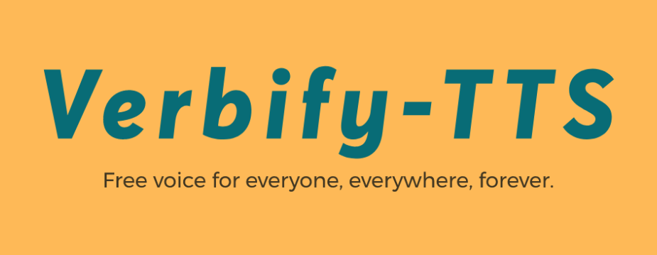

# Verbify-TTS


Verbify-TTS is a simple Text-to-Speech (TTS) engine that reads for you any text on your screen with high-quality voices powered by AI models.
It is free and you can use it for unlimited time (Open Source [MIT LICENSE](LICENSE)).



The main features of *Verbify-TTS* are:

1. **Compatible with any desktop Application**: Verbify-TTS is compatible with any desktop application where you can select text with your mouse.
1. **High-quality voices powered by AI**: The voices of Verbify-TTS are powered by AI and they learned on thousands of audio and text data.
1. **Free and unlimited usage**: You can use the voices of Verbify-TTS for free and for unlimited time, all you need is to install Verbify-TTS on your system.
1. **Registration-free**: You don't need to register to use Verbify-TTS, no subscription needed.
1. **Private data**: the data the application reads stay only on your device. There is no tracking or monitoring whatsoever. Everything is under your full control.
1. **Customizable**: convert each special or domain-specific word into another word combination. We have some example such as "e.g." pronounced as "for example". Modify the simple [`idioms.csv`](idioms.csv) file and add yours.

Some popular use cases of Verbify-TTS are:
 - read your **pdf** research papers or your favorite book. Verbify-TTS is compatible with any document reader or ebook reader (e.g. Adobe Reader, Okular, Calibre, and others)
 - **any desktop app**, such as word processors (e.g. Microsoft Word, LibreOffice Writer, etc.)
 - any web browser and **web page** (e.g. Google Chrome, Mozilla Firefox, Safari, etc.)
 - anywhere in your device where you can select and copy text from with your mouse.


## Simple Installation Guide for Everyone
This guide is designed also for non-tech people.

If you are more a visual guy, you can also look at the [VIDEO TUTORIAL](https://youtu.be/hb1ZVwUcPCU) I created for you.

To install the *Verbify-TTS* on your system you need to follow few simple steps.
Note that, for those of you unfamiliar with technology we have some *tips* to help you.


1. **INSTALL PYTHON 3**. Python is a software (or better called programming language) which *Verbify-TTS* uses to run, thus your computer should have it installed. We need version 3.8 or higher. *Tip*: to install Python on your system follow these step-by-step videos: [video for Windows](https://www.youtube.com/watch?v=UvcQlPZ8ecA&ab_channel=ProgrammingKnowledge2) or [video for Mac](https://www.youtube.com/watch?v=M323OL6K5vs&ab_channel=techTFQ).

1. **DOWNLOAD VERBIFY FILES.** Download the content of this Github repository in your device, one way to do that is using your command `git clone`.
*Warning*: place these files in a definitive location since moving them after the installation is completed will likely compromise the functionality of the application.
*Tip*: If you are not familiar with Git, watch [this video](https://www.youtube.com/watch?v=X5e3xQBeqf8&ab_channel=ElektorTV) to learn how to download the content of this repository.

1. **OPEN THE TERMINAL.** Open the terminal at the main folder of the repository, namely the folder containing the `README.md` file.
*Tip*: If you are not familiar with terminal, watch [this video (Mac OS)](https://www.youtube.com/watch?v=KqtKD8z-NRc&ab_channel=SagarS) or [this video (Windows)](https://www.youtube.com/watch?v=GlsMpvkRxIg&ab_channel=ukneex) to learn how to open the terminal in the specified folder.

1. **RUN THE INSTALLATION PROGRAM.**

    1. LINUX case (for the moment the only tested): Type the following in your terminal and click enter:
        ```bash
        ./INSTALL_LINUX.sh
        ```
        The installer will stop when all the packages have been downloaded and it will ask you if you want to start the service at each startup of the computer, type `y` and click enter, then insert the password of the `root` user or admin.
    1. MAC OS and WINDOW (open an issue in this repository if interested, or upvote an existing one.)

1. **SET YOUR KEY SHORTCUT.** At the end of the installation, the terminal will give you two commands which you have to connect to the key bindings of your window manager system so that you can use these shortcut anywhere.
This is dependent on the specific window manager you are using, so you have to Google a bit on how to do that in your specific case. I tested on XFCE you can find it [here](https://docs.xfce.org/xfce/xfce4-settings/4.14/keyboard). We recommend ALT + ESC to start the reading and ALT + END to end the reading, but you can choose whatever you want.

1. **RESTART AND READY TO GO!** Once you connected the key bindings, you have to restart the system and Verbify-TTS will be ready to use. Select any text and press the key binding you have set (e.g. ALT + ESC) to read it out loud.

1. **LEAVE A STAR.** If you like Verbify-TTS please drop a star at the top right of this page to support the project and thank the developers.


*Change reading speed*: change the constant `reading_speed` in the configuration file at [configuration/config.yaml](configuration/config.yaml).
A value of `1.45` is the default reading speed which I use to be more productive, but `1` is the value to give a more natural voice, just a bit slower.

## Disclaimer
Note: the system has been tested with:
- Linux (Ubuntu 20.04)
- Python 3.8.8
- XFCE window manager for shortcut (Xubuntu 20.04)
Feel free to open an issue in this repository if you are having troubles with the installation on another operative system.

Other configurations are not guaranteed to work, please create an issue so that we can help you.


## Acknowledgements
Thanks to [TensorSpeech](https://github.com/TensorSpeech) for having trained and shared under [Apache License 2](https://www.apache.org/licenses/LICENSE-2.0) the AI models used under-the-hood by Verbify-TTS: [tensorspeech/tts-fastspeech2-ljspeech-en](https://huggingface.co/tensorspeech/tts-fastspeech2-ljspeech-en) and [tensorspeech/tts-mb_melgan-ljspeech-en](https://huggingface.co/tensorspeech/tts-mb_melgan-ljspeech-en).

Beside leaving a start to Verbify-TTS, please drop a star also on their [repository](https://github.com/TensorSpeech) since they were vital for the success of Verbify-TTS.

Thanks to the researchers who developed the AI models:
- [**FastSpeech 2: Fast and High-Quality End-to-End Text to Speech**](https://arxiv.org/abs/2006.04558), Yi Ren and Chenxu Hu and Xu Tan and Tao Qin and Sheng Zhao and Zhou Zhao and Tie-Yan Liu.
- [**Multi-band MelGAN: Faster Waveform Generation for High-Quality Text-to-Speech**](https://arxiv.org/abs/2005.05106), Geng Yang and Shan Yang and Kai Liu and Peng Fang and Wei Chen and Lei Xie.
